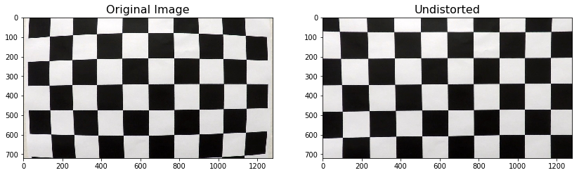
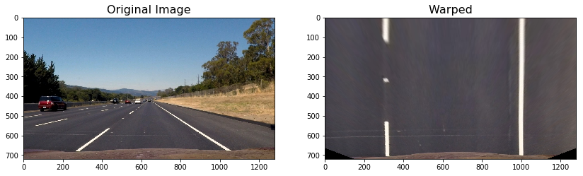
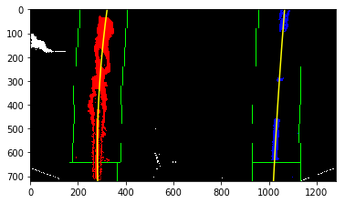
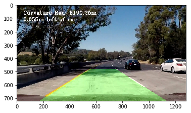

## Writeup Template

### You can use this file as a template for your writeup if you want to submit it as a markdown file, but feel free to use some other method and submit a pdf if you prefer.

---

**Advanced Lane Finding Project**

The goals / steps of this project are the following:

* Compute the camera calibration matrix and distortion coefficients given a set of chessboard images.
* Apply a distortion correction to raw images.
* Use color transforms, gradients, etc., to create a thresholded binary image.
* Apply a perspective transform to rectify binary image ("birds-eye view").
* Detect lane pixels and fit to find the lane boundary.
* Determine the curvature of the lane and vehicle position with respect to center.
* Warp the detected lane boundaries back onto the original image.
* Output visual display of the lane boundaries and numerical estimation of lane curvature and vehicle position.

[//]: # (Image References)

[image1]: ./examples/undistort.png "Undistorted"
[image2]: ./examples/warped.png "Warp Example"
[image3]: ./examples/binary.png "Binary Example"
[image4]: ./examples/sliding_window.png "Sliding Window"
[image6]: ./examples/data.jpg "Output"
[video1]: ./project_video_output.mp4 "Video"

### Camera Calibration and Undistortion

Camera calibration was done using 20 chessboard images. 2D points of the image corners were detected using "cv2.findChessboardCorners" method. The actuale 3D points on the chess border and the 2D detected points were used in "cv2.calibrateCamera" method to calculate camera calibration parameters. With the calculated parameters, the image is undistorted using "cv2.undistort" method. The undistortion procedure was defined as "undistort" method in the code. Below is an example of a road image and its undistorted copy on the right.

### Perspective Transform

I used the following pixel indices in order to capture a trapezoid in the original image to transform into a rectangle. 

Upper vertices of trapezoid: [550, 480], [730, 480]

Lower vertices of trapezoid: [195, 720], [1085, 720]

Transform into:

Upper vertices of rectangle: [300,0], [980,0]

Lower vertices of rectangle: [300,720], [980,720]

Function "cv2.getPerspectiveTransform(src, dst)" was used to derive transformation coefficient. An image with straight and parallel lines can prove that the transformation is appropriate if both lane lines appear as parallel with no curvature. This process was defined as `warp` method.

### Creating Binary Image to Bold Lane Lines

I used a combination of S, L, b, and x-gradient to detect lines. You can find the threshold of the channels in the code. Each channel or gradient can provide part of the required line detection. This process was defined as `binary` method.

### Lane Line Detection

I used the sliding window method in order to detect lane lines on images. Margin of 100 pixels around the line was used to define boundaries of the sliding windows. Total number of 9 windows were used on each image. This process was defined as `fit_line` method.

A similar method used based on lines found by sliding window method in order to only search only within the defined windows for a quicker line detection. This method is defined as `margin_search`.

### Calculation of Radius of Curvature

A set of polynomial fits were found in the previous step. The radius of the curvature was calculated as described here. The measurement was corrected to real world values using a standard conversion from pixel to meters (3.7/680 in the x-direction and 30/720 in the y-direction). This process was defined as `curv_rad` method. Calculated left and right curvature for one of the test images is as follow:

2619.02001547 m     2863.66794791 m

#### 6. Provide an example image of your result plotted back down onto the road such that the lane area is identified clearly.

I defined `project_lane` and `draw_data` in order to project the detected lane/lines, radius of curvature, and distance between center of the car and lane onto image. Here is an example of the plotted lane and data.

---

### Pipeline (video)

#### 1. Provide a link to your final video output.  Your pipeline should perform reasonably well on the entire project video (wobbly lines are ok but no catastrophic failures that would cause the car to drive off the road!).

Here's a [link to my video result](./project_video.mp4)

---

### Discussion

#### 1. Briefly discuss any problems / issues you faced in your implementation of this project.  Where will your pipeline likely fail?  What could you do to make it more robust?

Here I'll talk about the approach I took, what techniques I used, what worked and why, where the pipeline might fail and how I might improve it if I were going to pursue this project further.  
