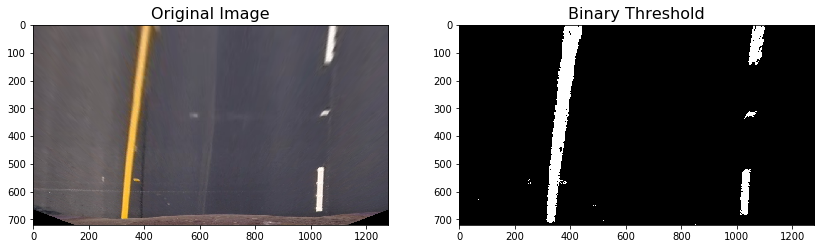

#  Advanced Lane Finding Project

### Project Description

This project builds an advanced lane finding program using distortion correction, image rectification, color transforms, and gradient thresholding to create a lane area map. Additionally, the project outputs the lane curvature and vehicle center deflection from lane center.

[//]: # (Image References)

[image1]: ./examples/undistort.png "Undistorted"
[image2]: ./examples/warped.png "Warp Example"
[image3]: ./examples/binary.png "Binary Example"
[image4]: ./examples/sliding_window.png "Sliding Window"
[image6]: ./examples/data.jpg "Output"
[video1]: ./project_video_output.mp4 "Video"

### Camera Calibration and Undistortion

Camera calibration was done using 20 chessboard images. 2D points of the image corners were detected using "cv2.findChessboardCorners" method. The actuale 3D points on the chess border and the 2D detected points were used in "cv2.calibrateCamera" method to calculate camera calibration parameters. With the calculated parameters, the image is undistorted using "cv2.undistort" method. The undistortion procedure was defined as "undistort" method in the code. Below is an example of a road image and its undistorted copy on the right.

### Perspective Transform

I used the following pixel indices in order to capture a trapezoid in the original image to transform into a rectangle. 

Upper vertices of trapezoid: [550, 480], [730, 480]

Lower vertices of trapezoid: [195, 720], [1085, 720]

Transform into:

Upper vertices of rectangle: [300,0], [980,0]

Lower vertices of rectangle: [300,720], [980,720]

Function "cv2.getPerspectiveTransform(src, dst)" was used to derive transformation coefficient. An image with straight and parallel lines can prove that the transformation is appropriate if both lane lines appear as parallel with no curvature. This process was defined as `warp` method.

### Creating Binary Image to Bold Lane Lines

I used a combination of S, L, b, and x-gradient to detect lines. You can find the threshold of the channels in the code. Each channel or gradient can provide part of the required line detection. This process was defined as `binary` method.

### Lane Line Detection

I used the sliding window method in order to detect lane lines on images. Margin of 100 pixels around the line was used to define boundaries of the sliding windows. Total number of 9 windows were used on each image. This process was defined as `fit_line` method.

A similar method used based on lines found by sliding window method in order to only search only within the defined windows for a quicker line detection. This method is defined as `margin_search`.

### Calculation of Radius of Curvature

A set of polynomial fits were found in the previous step. The radius of the curvature was calculated as described here. The measurement was corrected to real world values using a standard conversion from pixel to meters (3.7/680 in the x-direction and 30/720 in the y-direction). This process was defined as `curv_rad` method. Calculated left and right curvature for one of the test images is as follow:

2619.02001547 m     2863.66794791 m

#### 6. Provide an example image of your result plotted back down onto the road such that the lane area is identified clearly.

I defined `project_lane` and `draw_data` in order to project the detected lane/lines, radius of curvature, and distance between center of the car and lane onto image. Here is an example of the plotted lane and data.

---

### Pipeline (video)

The video pipeline performs all the previous steps on each frame of the video. The pipeline decides which method to be used to detect the lane lines, `sliding_window` or '`margin_search`. The pipeline makes the decision based on a check that it performs to determine how parallel the right and left lines are. For the purpose of smoothing, it weighs the previously processed frames and lines. The weighs are decreasing from frame n-1 to n-4. Below is a linke to the video.

Here's a [link to my video result](./project_video_output.mp4)

---

### Discussion

There are many ways to improve the performance of the pipeline. Improvements can be mainly made on video processing pipeline. Also, it is possible to define a more intelligent way to create binary images based on the original image. 
A problem I faced was the slow performance of the pipeline. This can be due to the fact my computer does not have a dedicated GPU. Also, the code can be modified to downsize images and rescale them back to the original size.